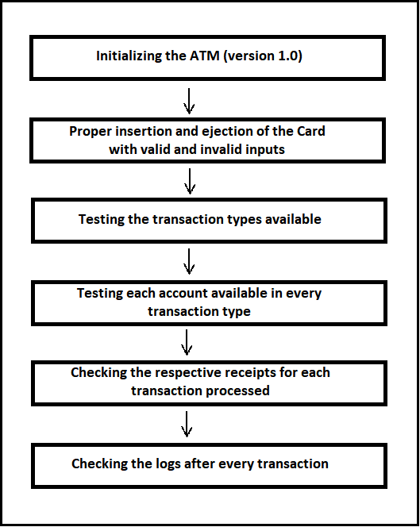

>   **SENG 637- Dependability and Reliability of Software Systems**

**Lab. Report \#1 – Introduction to Testing and Defect Tracking**

| Group \#:  17     |   |UCID|
|-----------------|---|------|
| Student Names:  | Sai Preetham Chakka  |30111565|
|                 | Karhik Kumar Reddy Gangireddy  |30111566|
|                 | Chandrahas Reddy Pola  |30140068|
|                 | Satya Rellu  |30143162|

**Table of Contents**
- [Introduction](#introduction)
- [Link of demo video](#link-of-demo-video)
- [High-level description of the exploratory testing plan](#high-level-description-of-the-exploratory-testing-plan)
- [Comparison of exploratory and manual functional testing](#comparison-of-exploratory-and-manual-functional-testing)
- [Notes and discussion of the peer reviews of defect reports](#notes-and-discussion-of-the-peer-reviews-of-defect-reports)
- [How the pair testing was managed and team work/effort was divided](#how-the-pair-testing-was-managed-and-team-workeffort-was-divided)
- [Difficulties encountered, challenges overcome, and lessons learned](#difficulties-encountered-challenges-overcome-and-lessons-learned)
- [Comments/feedback on the lab and lab document itself](#commentsfeedback-on-the-lab-and-lab-document-itself)

# Introduction

Automated Teller Machine will be controlled by the software, from which the ATM will recognize the card by the stripe reader present on the card. This project will include testing the software that is used to control the ATM. By using the ATM certain transactions can be performed which include deposit, withdrawal, balance enquiry and transfer of money between the accounts. Simply, it acts as a contact between the user and the bank server. When we insert the card, it will ask for the PIN and it will allow the customer to perform desired transactions after verification is done by the bank validation system. If the inserted PIN is wrong, it will ask to re-enter the Personnel Identification Number (PIN) and based on the consecutive steps the system will either proceed further or will retain the card if he/she enters the incorrect PIN a couple of times. 

Furthermore, the ATM Machine displays different transaction types to choose from based on the accounts that are linked to the card. Based on our requirement we must choose the required option. Since, ATM’s play a decisive role in performing different transaction types, it is very important to be sure about the software associated with them. The main aim of this project is to rigorously test the software developed and find the bugs associated with it. There are a few standard testing methods that can be performed on the software applications to find out the bugs and report them accordingly. The testing methods used in this project include exploratory testing, manual testing, and regression testing.

**Exploratory Testing**

Exploratory testing is a type of software testing where we focus mainly on simultaneous learning, test design and execution. It primarily focuses on the discovery and relies on the guidance of the individual tester to uncover defects that are not easily covered in the space of other tests. Exploratory testing is an unorganized kind of testing where we don’t follow any order for performing the test cases.

**Manual Testing**

Manual testing is the type of software testing where we can test the test cases manually without any automated tools. By performing manual testing, we can find out bugs, issues, and defects in the software application. Manual testing is a primitive technique where we can find critical bugs in the software. Any application should be manually tested to be automated. Manual testing requires more effort compared to automated testing. Manual testing doesn’t require any knowledge of any testing tools. Testing checks the quality of the system and delivers the bug-free product to the customer.

There are different types in manual testing which include:

1.	Black box testing
2.	White-box testing
3.	Unit testing
4.	System testing
5.	Integration Testing
6.	Acceptance Testing

**Regression Testing**

Regression testing is a powerful testing practice that ensures to run the application as per the prediction after bug fixes that have been detected before. This testing type is mainly responsible for running the application with stability and at its full functionality. To make developments and integrate changes in the applications, developed applications or software’s must go through multiple tests. Regression testing is the final step before delivering the application.

After doing new modifications to the code, this testing is responsible to ensure that the system stays sustainable under continuous improvements. These modifications might include bug fixes such as defects. This code mainly targets the bugs that were previously present in the version code before bug fixes, so that the updated code remains operational after new changes. 

# Link of demo video 

Make a video of the demo and put its link here.
All members must participate in the demo and the video should not be longer than 10 minutes.

# High-level description of the exploratory testing plan

Exploratory testing is a type of software testing in which the tester doesn’t follow any methodology to test the software. The tester can test the cases in any possible approach. In exploratory testing, the software developers will use their learning, knowledge, skills, and abilities to test the software developed by themselves. Exploratory testing is used to check the functionality and operations of the software as well as it identifies the technical faults in it. It is used to improve the software in every possible way. The exploratory testing combines the tester skills and provides a structured way of approach to the software fault. 

There are four steps involved in the exploratory testing process:
1.	Learn
2.	Test Case Creation
3.	Test Case Execution
4.	Analysis

**Learn**

It is the initial stage of testing where the tester learns about the faults or issues in the software and uses his/her skill and experience to observe what kind of problem the software is facing and tries to solve them.

**Test Case Creation**

In this, the tester identifies the problem faced by the software. In the test case creation, the tester develops the test case according to the defects, to test the software. Test cases are designed by keeping in mind the problems faced by the end-users.

**Test Case Execution**

After the creation of test cases based on the problems, the tester will run the test cases. Test case execution is very essential in any testing process. It includes the computational and operational tasks performed by the software to get the desired output.

**Analysis**

After the execution of test cases, the output is analyzed and observed whether the software is working properly or not. If the defects are found, the above three steps are performed again, and the problems are solved. This is the cyclic process that is performed until all the bugs are removed and the software is released without any faults in the market.
  
By keeping these basic principles in mind, our team has designed a high-level exploratory testing plan to find out the bugs present in the software. The developed test plan has been represented in the figure 1.

# Comparison of exploratory and manual functional testing
Generally, in manual testing, we must follow a particular procedure to perform the test cases and it is the initial stage of testing. Were as exploratory testing is treated as an informal test design technique in which learning, test design and execution are done simultaneously. Exploratory testing mostly relies on the testers ability to uncover most of the bugs and issues that were not discovered during any other testing. These tests mainly depend on the tester’s skillset, availability of time for testing the application or software and the tools (environments) that are available for testing.   Few comparisons between exploratory testing and manual testing are given in table 1.

-   Note that you need to submit a report generated by your defect tracking
    system, containing all defects recorded in the system.

# Notes and discussion of the peer reviews of defect reports

Reporting is considered as the main part and tremendous importance is given to it in software testing. Defect reports otherwise called as bug report is the documentation that is structured by the tester while performing testing. A proper defect report be specific and include the detailed information of the bugs found while performing the testing such as description, type of defect found, defect found by, defect found date, progress of the defect, etc. By using this information from the defect report, necessary steps can be taken by the developers to go through the defects and fix them accordingly. 

These reports act as an incredibly useful barriers and considered as most important deliverables between the testers and the developers. Improper or poor structuring of the defect reports might cause confusion and leads to lack to information related to the software or the application under test. This might cause delays in the development process and functionality of the software is at stake.

# How the pair testing was managed and team work/effort was divided 

Our team consists of 4 members. Based on the requirement of the assignment we divided ourselves into 2 teams with 2 members in each team. We divided the 40 test cases into 20 each and both the teams worked on it individually. Each team performed manual testing on the divided test cases and in the end, we combined our work. Furthermore, each team cross-verified each other’s work to achieve accurate results. Exploratory testing was also performed individually by both the teams and verified each reported defect present in the software by both the team members and reported the bugs in the backlog tool. At last, after reporting all the defects in the backlog tool, regression testing was performed on the updated version of the software by both teams and comments were given accordingly.

# Difficulties encountered, challenges overcome, and lessons learned

Our team is completely new to this course. By doing the assignment, we faced some issues in implementing the concept learned and at the same time presenting our ideas on the assignment. Although we had an initial struggle in understanding the concepts as they were new to us, we were able to overcome and learn concepts such as manual testing, regression testing and exploratory testing. Furthermore, their practical implementation in this assignment helped us a lot to understand the importance of these concepts in software testing. To release any application or software into the market it must undergo several tests. We learned that manual testing is the initial stage of testing where a step-by-step approach is essential to perform the testing on the software. On the other hand, exploratory testing purely depends on the skills and the way we use our ideas and knowledge to identify the issues present in the software. Moreover, exploratory testing is said to be the prominent testing as all the faults and bugs will be minimized in this testing. At the initial stage of reporting the bugs, we faced a few difficulties in understanding some functionalities of the backlog tool, but by watching tutorials we were able to overcome it. Even if we faced any difficulty with the assignment, the team members helped each other mutually and worked on it.

# Comments/feedback on the lab and lab document itself

This lab has provided a clear view on different software testing concepts such as exploratory, manual scripted and regression. The practical implementation and hands-on experience of these concepts has given us an overview on the importance of testing in any software or application before it’s deployment into the market. This lab document has provided us with an in-depth understanding on importance of defect reports and significance of recording each test case and the methods used to analyze the bugs in it. The backlog tool works great to keep track on, record the bugs and update them accordingly. The overall lab and lab document has provided us with good knowledge on the methods used to test the software, get familiarized with the common issues faced in software testing and their resolutions.
